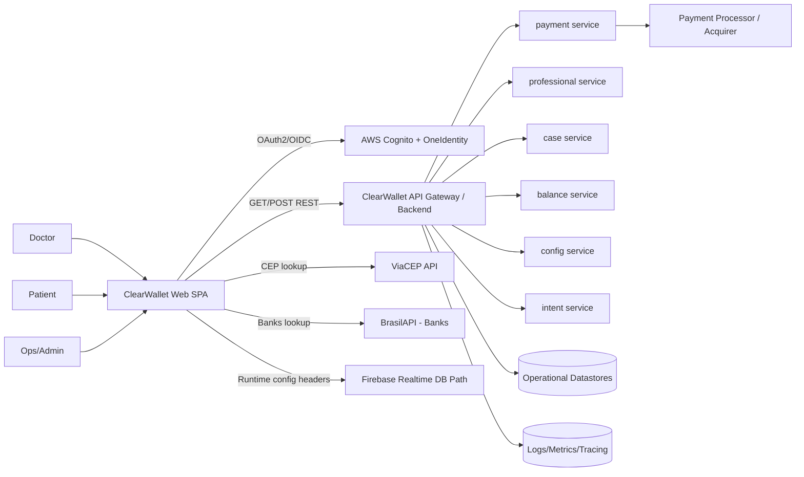

# ClearWallet

## 1. Executive Summary
ClearWallet is a split-payment platform for ClearCorrect dentists that enables a doctor to define the treatment amount, choose installment rules, and generate a secure patient payment link. Once paid, the platform orchestrates revenue split so the doctor receives the professional portion and ClearCorrect receives the company portion.

**Business value**
- Accelerates treatment conversion by reducing payment friction.
- Improves cashflow predictability for both doctors and ClearCorrect.
- Standardizes billing and payment governance across clinics.
- Integrates with Straumann Group SSO for unified access and identity control.

**Problems solved**
- Manual, error-prone payment coordination between clinic and patient.
- Lack of visibility over case status, settlement, and receivables.
- Fragmented authentication across Straumann ecosystem platforms.
- Operational overhead in collecting patient payments and reconciling amounts.

**Strategic impact**
- Supports scalable digital commerce for orthodontic workflows.
- Enables data-driven financial operations via dashboard and extract views.
- Creates a reusable platform foundation for additional payment capabilities.

---

## 2. Product Vision and Objectives
**Long-term vision**
- Become the default payment orchestration layer for ClearCorrect case monetization in LATAM and beyond, with secure, compliant, and flexible checkout experiences.

**Strategic goals**
- Increase doctor adoption and patient payment completion rates.
- Minimize failed or abandoned payments through resilient retry/status flows.
- Provide real-time operational visibility for doctors and operations teams.
- Maintain enterprise-grade security and compliance readiness (LGPD/GDPR).

**Key differentiators**
- Native split-payment business flow for dental treatments.
- Dedicated professional and patient journeys with status-driven orchestration.
- SSO integration with Straumann Group identity federation.
- Installment-aware pricing and fee-responsibility logic.

---

## 3. System Overview
ClearWallet is a web SPA (Angular + Ionic UI components) connected to backend payment APIs. It supports three major journeys:

- Professional journey: configure case payment, set installments, generate/update payment link.
- Patient journey: open link, review case/payment info, pay by card (single or split across two cards), monitor outcome.
- Dashboard journey: authenticated professional area with summary, extract, case list, and bank-account management.

**Main components**
- `Professional Page`: billing link generation and installment configuration.
- `Patient Page`: checkout, payment submission, and completion/expired states.
- `Dashboard`: operational monitoring and account maintenance.
- `Request/API layer`: typed service abstraction over backend endpoints.
- `Security layer`: Cognito-based SSO token handling + request encryption/interceptor pipeline.

---

## 4. Architecture

### 4.1 High-Level Architecture Description
- **Architecture style**: Modular frontend monolith (SPA) integrated with distributed backend services (payment, professional, case, balance, config).
- **Interaction model**:
  - REST APIs for core domain operations.
  - OAuth2/OIDC flow with Cognito-hosted UI and enterprise identity provider.
  - External data calls for CEP and bank list enrichment.
- **Deployment model**:
  - Frontend build artifact generated in CI and deployed via AWS deployment pipeline components.

### 4.2 Architecture Diagram (in Mermaid)


### 4.3 Core Layers
**Presentation Layer**
- Angular components under `src/app/layers/pages` and `src/app/layers/ui`.
- Ionic modal/toast UX for confirmations, failures, and informational status.
- Responsive behavior for desktop/mobile.

**Application Layer**
- Orchestrates use cases in page components:
  - `create-billing`
  - `checkout-forms`
  - `professional-dashboard-page`
- Handles state transitions based on backend payment status.

**Domain Layer**
- Domain contracts in `src/app/shared/interfaces`.
- Strongly typed entities for payment updates, patient/professional views, and status enums.

**Infrastructure Layer**
- HTTP abstraction via `APIConnector`.
- Auth interceptor for tokens, headers, and route-specific authorization behavior.
- Encryption service for selected request levels (`level 2` and `level 3`).

**Data Layer**
- Backend APIs as source of truth.
- Frontend local/session storage wrappers with encryption for selected values.
- Runtime/environment configuration files by deployment stage.

**AI/ML Layer (if applicable)**
- No AI/ML runtime layer is currently implemented in this repository.

### 4.4 Integration Points
- **Identity**: AWS Cognito (`/oauth2/authorize`, logout) + enterprise provider (`OneIdentity`).
- **Core APIs**: `payment`, `professional`, `case`, `balance`, `config`, `intent`.
- **External APIs**:
  - ViaCEP for address auto-fill from CEP.
  - BrasilAPI for bank catalog.
  - Country/State/City local package (`countrycitystatejson`).
- **Queue/Webhook usage**:
  - Not implemented in this frontend repository (likely backend concern).

---

## 5. Technology Stack

| Layer | Technology | Purpose |
|---|---|---|
| Frontend Framework | Angular 16 | SPA architecture and routing |
| UI Framework | Ionic Angular 7 | Modals, toasts, mobile-friendly components |
| Language | TypeScript 5 | Type safety and maintainability |
| Styling | SCSS | Component-level and global styling |
| Build Tooling | Angular CLI | Build/serve/test orchestration |
| Testing | Karma + Jasmine | Unit testing |
| Security | CryptoJS, custom interceptors | Request/storage encryption and token flow |
| Payment UX | angularx-qrcode, credit-card-type | PIX QR and card-brand handling |
| Cloud Identity | AWS Cognito | SSO and token issuance |
| CI | Azure Pipelines | Artifact packaging and S3 upload |
| CD Build | AWS CodeBuild (`buildspec.yml`) | Environment-specific Angular build |
| CD Deploy | AWS CodeDeploy (`appspec.yml`) | Delivery to target host |
| Runtime Config | Firebase RTDB path + API config | Environment/runtime toggles |

**Mobile (if any)**
- No native mobile app in this repository; responsive web experience only.

**AI/ML frameworks**
- Not applicable in current implementation.

**Observability tools**
- No frontend observability SDK configured in this repository.

---

## 6. Data Architecture
**Data sources**
- Internal backend services (`/payment`, `/professional`, `/case`, `/balance`, `/config`).
- External enrichment sources (ViaCEP, BrasilAPI).
- User identity tokens from Cognito redirect flow.

**Data flows**
1. Professional opens secure link with `documentNumber` + `caseId`.
2. Frontend fetches case/payment metadata.
3. Professional updates total/installments and publishes patient link.
4. Patient submits payment payload (card details + address/contact + installments).
5. Frontend polls payment status and updates UX (processing/success/refused/expired).
6. Dashboard reads account summary/extract/cases for operational visibility.

**ETL / pipelines**
- No ETL in frontend scope.
- Delivery pipeline includes: zip artifact (Azure) -> S3 -> CodeBuild -> deploy target.

**Storage strategy**
- Browser storage wrappers (`LocalStorage`, `SessionStorage`) with encryption.
- Backend remains system of record for transactional and financial data.

**Governance and security**
- Token-based access for dashboard paths.
- Encrypted payload strategy for sensitive endpoints.
- Explicit status-driven flow control to avoid duplicate/invalid payment transitions.

---

## 7. Core Features

### 7.1 Billing Link Generation (Professional)
- **Description**: Doctor configures payment constraints and generates/updates patient link.
- **User value**: Fast case monetization with clear installment options.
- **Technical approach**: `payment.findForProfessional` + `payment.updateForProfessional`.
- **Dependencies**: Payment API, status orchestration, fee table rendering.

### 7.2 Patient Checkout and Payment
- **Description**: Patient validates info and pays by card; supports split across two cards.
- **User value**: Flexible payment execution with installment selection.
- **Technical approach**: `payment.updateForPatient` with secure request level and intent header.
- **Dependencies**: Card form validation, CEP enrichment, payment status polling.

### 7.3 Payment Status Lifecycle
- **Description**: Statuses include `RELEASED_FOR_PROFESSIONAL`, `RELEASED_FOR_PATIENT`, `PAYMENT_PROCESSING`, `PAYMENT_REFUSED`, `PAYMENT_SUCCESSFUL`, `EXPIRED`.
- **User value**: Predictable, transparent process and clear UX outcomes.
- **Technical approach**: polling loop + state-based routing/modals.
- **Dependencies**: Payment API consistency and timeout/error handling.

### 7.4 Professional Dashboard
- **Description**: Summary, extract, cases, and bank account maintenance.
- **User value**: Better financial and operational control.
- **Technical approach**: `professional` + `case` + `balance` services.
- **Dependencies**: SSO token availability, account info endpoint.

### 7.5 Maintenance Mode Control
- **Description**: Frontend checks config flag and redirects to maintenance page when active.
- **User value**: Controlled downtime communication.
- **Technical approach**: `config.find-by-name` at app startup.
- **Dependencies**: Config API availability.

---

## 8. Security and Compliance
**Authentication/Authorization**
- OAuth2/OIDC redirection via Cognito.
- Dashboard requests use bearer token from secure login flow.
- Token lifecycle includes logout and token clearing.

**Data protection**
- Request parameter/body encryption for selected operations.
- Encrypted wrappers for local/session storage content.
- Route-based handling for expired/unauthorized responses.

**LGPD/GDPR considerations**
- Personal and payment data processed only for explicit transaction purpose.
- Recommend data minimization, retention policy enforcement, and legal-basis documentation in backend governance.
- Ensure DSR/subject-right operations are supported by system-of-record services.

**Secrets management**
- Current environment files contain sensitive constants; production hardening should move secrets to secure runtime configuration (for example, AWS Secrets Manager or SSM).

**Audit and logging**
- Frontend currently logs minimal errors.
- Full audit trail should be centralized in backend payment and identity services.

---

## 9. Scalability and Performance
**Scaling strategy**
- Stateless SPA scales horizontally via CDN/static hosting.
- Backend services should scale independently per domain (`payment`, `professional`, etc.).

**Load handling**
- Polling-based status checks currently at fixed intervals (4s/5s).
- Recommend migration to push/webhook-driven notifications for high traffic.

**Performance optimizations**
- Angular production build with output hashing.
- Lazy loading in dashboard summary module.
- Route-level separation of professional/patient/dashboard flows.

**Caching**
- Browser-level static asset caching from hashed bundles.
- Controlled local storage for auth/session state.

**Concurrency**
- Status transitions prevent conflicting actions (processing/success/refused/expired guards).
- Retry/unblock flow handles contention on patient payment attempts.

---

## 10. DevOps and Deployment
**CI/CD pipeline**
- **Azure Pipelines**:
  - Triggered on `qa`, `homolog`, `main`.
  - Creates zip artifact and uploads to S3 (`tech-innovation-builds`).
- **AWS CodeBuild**:
  - Node `20.12.1`.
  - Runs `ng build --configuration ${ENV_NAME}`.
- **CodeDeploy/AppSpec**:
  - Deploys built output to target host path.

**Environments (dev, staging, prod)**
- `development`
- `homolog`
- `production`

**Infrastructure as Code**
- Not fully represented in this repository.
- Build/deploy spec files are present (`azure-pipelines.yml`, `buildspec.yml`, `appspec.yml`).

**Release strategy (blue/green, canary)**
- Branch-driven promotion pattern (`qa` -> `homolog` -> `main`).
- Can be extended to blue/green or canary at hosting layer.

---

## 11. Observability and Monitoring
**Logging**
- Frontend logs runtime errors to console.
- Recommendation: integrate centralized frontend logging (Sentry/DataDog) with correlation IDs.

**Metrics**
- No web metrics SDK configured.
- Recommendation: track checkout funnel, conversion, refusal rate, retry rate, payment latency.

**Alerting**
- Not configured in frontend repo.
- Recommendation: backend/API and synthetic UX alerts for payment critical paths.

**Tracing**
- No distributed tracing instrumentation in frontend.
- Recommendation: propagate trace/correlation headers from frontend to backend.

---

## 12. AI/Intelligence Layer (if applicable)
Current version has no AI models, prompt orchestration, agents, or RAG pipeline.

**Potential future opportunities**
- Payment refusal reason clustering and smart retry suggestions.
- Predictive installment recommendations for conversion uplift.
- Anomaly detection for fraud/risk signals (in coordination with compliance).

---

## 13. API Design
**API style (REST, GraphQL)**
- REST over HTTPS.

**Versioning**
- Base API includes version path (for example, `/1.0`).

**Authentication**
- Bearer token for dashboard-authenticated flows.
- Basic auth fallback used for non-dashboard route contexts (current implementation detail).

**Main endpoints (example format)**

| Domain | Method | Endpoint | Purpose |
|---|---|---|---|
| Payment | GET | `/payment/find-for-patient` | Retrieve patient-facing case/payment state |
| Payment | GET | `/payment/find-for-professional` | Retrieve professional-facing case/payment state |
| Payment | POST | `/payment/update-for-professional` | Set/update amount and installment policy |
| Payment | POST | `/payment/update-for-patient` | Submit payment data |
| Payment | POST | `/payment/unblock-link` | Enable retry flow after refusal/errors |
| Professional | GET | `/professional/find-account-info` | Load professional account data |
| Professional | POST | `/professional/update-account` | Update bank/account details |
| Professional | GET | `/professional/find-users-monthly-and-daily` | Dashboard aggregation |
| Case | GET | `/case/find-for-user` | List user cases |
| Balance | GET | `/balance/find-for-user` | User balance data |
| Config | GET | `/config/find-by-name?name=on_maintainance` | Maintenance toggle |
| Intent | POST | `/intent/add` | Register secured payment intent |

---

## 14. Project Structure
```text
src/
  app/
    layers/
      pages/
        patient-page/
        professional-page/
        professional-page-dashboard/
        maintenance-page/
        not-found-page/
      ui/
        ...reusable components (modals, inputs, cards, tables, loaders)
    shared/
      animations/
      consts/
      directives/
      interceptors/
      interfaces/
      pipes/
      requests/
        Internal/
        External/
      serializer/
      services/
      Storage/
      styles/
      validators/
    app.module.ts
    app-routing.module.ts
  environments/
    environment.ts
    environment.homolog.ts
    environment.prod.ts
  assets/
```

**Folder responsibilities**
- `layers/pages`: business journeys and route-level orchestration.
- `layers/ui`: reusable design-system-like UI building blocks.
- `shared/requests`: API abstraction and service contracts.
- `shared/interfaces`: domain DTOs and type-safe contracts.
- `shared/interceptors/services`: cross-cutting concerns (auth, encryption, routing helpers).
- `environments`: stage-specific runtime configuration.

---

## 15. Getting Started
**Requirements**
- Node.js `20.12.1` (aligned with build pipeline)
- npm `>=10`
- Angular CLI `16.x`

**Installation steps**
```bash
npm install
```

**Environment variables/configuration**
- Build-time environment files:
  - `src/environments/environment.ts`
  - `src/environments/environment.homolog.ts`
  - `src/environments/environment.prod.ts`
- Key settings:
  - `API`
  - `REAL_TIME_DATA_BASE`
  - `COGNITO.POOL_ID`
  - `COGNITO.CLIENT_ID`
  - `COGNITO.IDENTIFIER_PROVIDER`
  - `APP_ID`
  - encryption constants

**Local run instructions**
```bash
npm run start
```

**Build**
```bash
npm run build
npm run homolog
npm run prod
```

**Test**
```bash
npm run test
```

---

## 16. Usage Examples
**API call example: professional updates billing terms**
```http
POST /payment/update-for-professional
Content-Type: application/json

{
  "documentNumber": "12345678901",
  "caseId": "CASE-001",
  "totalAmount": 2500.00,
  "maxInstallments": 12
}
```

**API call example: patient submits payment**
```http
POST /payment/update-for-patient
Content-Type: application/json

{
  "documentNumber": "12345678901",
  "caseId": "CASE-001",
  "paymentMethod": [
    {
      "paymentMethod": "credit_card",
      "totalAmount": 2500.00,
      "name": "Patient Name",
      "email": "patient@example.com",
      "phoneCountry": "55",
      "phoneArea": "41",
      "phoneNumber": "999999999",
      "cpf": "00000000000",
      "cardNumber": "4111111111111111",
      "cardPrintedName": "PATIENT NAME",
      "cardExpiringMonth": "12",
      "cardExpiringYear": "27",
      "cardCvv": "123",
      "installments": 6,
      "paymentValue": 2500.00,
      "country": "BR",
      "cep": "01001000",
      "state": "SP",
      "city": "Sao Paulo",
      "street": "Av Paulista",
      "streetNumber": 1000,
      "streetComplement": "Suite 1"
    }
  ]
}
```

**API call example: check payment status**
```http
GET /payment/find-for-patient?documentNumber=12345678901&caseId=CASE-001
```

**CLI usage**
```bash
npm run start
npm run test
npm run prod
```

---

## 17. Roadmap
**Short term**
- Add frontend observability instrumentation and funnel metrics.
- Improve i18n/encoding consistency and UX copy standardization.
- Strengthen error taxonomy for payment failures.

**Mid term**
- Move from polling to event-driven status updates.
- Add PIX dynamic payload retrieval from backend (remove static placeholder behavior).
- Expand dashboard analytics and reconciliation drill-downs.

**Long term**
- Multi-country payment capability with locale/currency expansion.
- Advanced risk and fraud controls with adaptive authentication.
- Platform APIs for partner ecosystem integration.

---

## 18. Contribution Guidelines
**Branching strategy**
- Recommended flow aligned with pipeline:
  - `feature/*` -> `qa` -> `homolog` -> `main`
- Keep pull requests small, testable, and domain-focused.

**Commit pattern**
- Prefer Conventional Commits:
  - `feat: ...`
  - `fix: ...`
  - `refactor: ...`
  - `docs: ...`
  - `test: ...`
  - `chore: ...`

**Code standards**
- Use Angular style guide and strict TypeScript typing.
- Keep domain contracts in `shared/interfaces`.
- Centralize API calls through `shared/requests`.
- Add/maintain unit tests for business-critical logic.

---

## 19. License
Proprietary software owned by Straumann Group / ClearCorrect.  
No public redistribution is permitted without explicit authorization.

---

## 20. Appendix
**Glossary**
- **Case**: a treatment transaction context linked to doctor and patient.
- **Split Payment**: allocation of total payment between doctor and company.
- **Installments**: number of payment parcels allowed for a transaction.
- **Payment Link**: secure URL used by patient to complete checkout.

**Acronyms**
- **SSO**: Single Sign-On
- **OIDC**: OpenID Connect
- **CI/CD**: Continuous Integration / Continuous Deployment
- **LGPD**: Lei Geral de Protecao de Dados (Brazil)
- **GDPR**: General Data Protection Regulation (EU)
- **PSP**: Payment Service Provider

**References**
- Angular: https://angular.io/
- Ionic Framework: https://ionicframework.com/
- AWS Cognito: https://docs.aws.amazon.com/cognito/
- ViaCEP: https://viacep.com.br/
- BrasilAPI: https://brasilapi.com.br/
