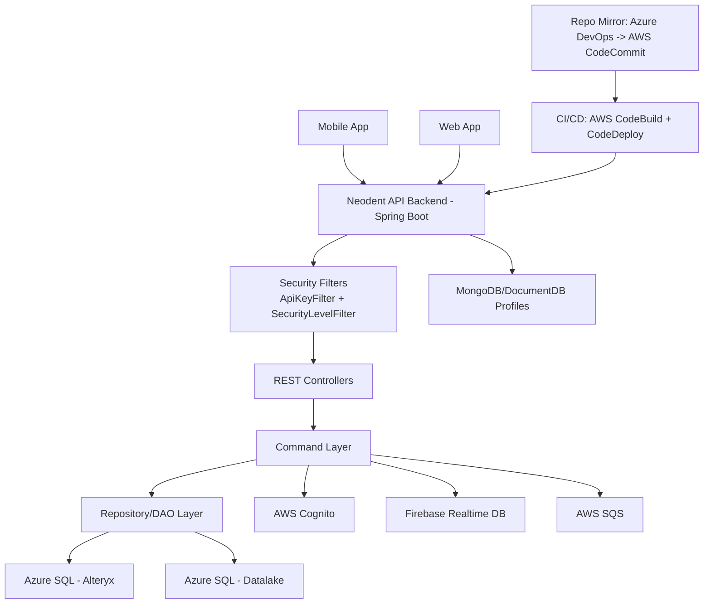

# Neodent Mobile App Backend

## 1. Executive Summary
Neodent Mobile App is an all-in-one digital platform that supports Neodent customers across mobile and web channels, consolidating key post-sales and commercial workflows into a unified experience. This repository contains the backend API layer that powers customer-facing capabilities such as pending payment visibility, contract acknowledgement, sales agent discovery, notification device management, and Firebase-backed dynamic content retrieval.

From a business perspective, the platform reduces operational friction by centralizing fragmented journeys that were traditionally distributed across emails, call centers, portals, and manual sales support. By exposing a secure, profile-driven API surface integrated with enterprise identity and data systems, the solution improves customer autonomy, response times, and channel consistency.

Problems solved:
- Fragmented customer interactions across disconnected tools
- Low visibility of financial and contractual status
- Slow support flows for account and agent-related requests
- Inconsistent data delivery between app experiences and enterprise systems

Strategic impact:
- Higher customer engagement and retention through one unified digital channel
- Better scalability of customer service operations
- Improved governance through centralized authentication, integration, and auditability
- Strong foundation for AI-enabled assistance and personalization

## 2. Product Vision and Objectives
### Long-term vision
Build the definitive digital operating platform for Neodent customers, where transactional, informational, and AI-assisted journeys coexist in a single, secure, and performant ecosystem.

### Strategic goals
- Deliver a single entry point for critical customer operations
- Increase self-service adoption and reduce manual back-office dependency
- Standardize integration with enterprise identity, financial, and CRM/ERP-adjacent data
- Enable iterative rollout of intelligent capabilities (Genia AI and contextual automation)

### Key differentiators
- Unified mobile and web experience backed by a centralized API
- Hybrid data strategy combining operational databases and real-time content stores
- Enterprise-grade identity integration (AWS Cognito + API security filters)
- Extensible command-based backend design for feature modularity

## 3. System Overview
This backend is a Spring Boot 3 (Java 17) service that exposes REST endpoints consumed by Neodent�s mobile/web channels. It orchestrates reads/writes across:
- AWS Cognito (identity lifecycle checks)
- Firebase Realtime Database (dynamic content retrieval)
- AWS SQS (asynchronous messaging capability)
- Azure SQL-backed datasets via Rotom connector
- MongoDB/DocumentDB profile-based connectivity

At runtime, the system applies lightweight stateless security, executes domain commands per feature, and returns normalized response envelopes (`RestData<T>`) to clients.

## 4. Architecture
### 4.1 High-Level Architecture Description
Architecture style: modular monolith backend with layered design and external service integrations.

Characteristics:
- Single deployable artifact (`bootJar`) per environment
- Internal modularization by endpoint/feature domain
- Command-oriented application logic (`CommandFactory` + command classes)
- Hybrid synchronous API + asynchronous integration readiness (SQS)

### 4.2 Architecture Diagram (Mermaid)


### 4.3 Core Layers
- Presentation Layer:
  - REST controllers under `src/main/java/project/neoapp/structure/endpoints/*`
  - Maps HTTP requests to domain use cases and security levels
- Application Layer:
  - Command classes under `src/main/java/project/neoapp/structure/commands/*`
  - Coordinates workflows, composition, and response shaping
- Domain Layer:
  - Feature models and DTOs representing use-case contracts
  - Encapsulates business operations (e.g., contract signatures, pending payments)
- Infrastructure Layer:
  - Providers/managers for Cognito, Firebase, SQS, and DB connectors
  - Deployment scripts and environment profile orchestration
- Data Layer:
  - DAO/Repository + Entity pattern over Rotom/Azure SQL and Mongo profiles
  - Handles persistence concerns and query strategies
- AI/ML Layer:
  - AI-facing hooks currently represented via dynamic Firebase content and FAQ ranking capture
  - Genia AI orchestration is primarily external to this repository and consumed by app ecosystem

### 4.4 Integration Points
- External services:
  - AWS Cognito (user existence and provisioning checks)
  - Firebase Realtime Database (feature/config/content retrieval)
  - AWS SQS (notification/message workflows)
- APIs:
  - REST endpoints under `/agent`, `/contract`, `/pending-payments`, `/notifications`, `/firebase`, `/rank`
- Message queues:
  - Queue names configured under `aws.queues.*`
- Webhooks:
  - No explicit webhook controller in current codebase

## 5. Technology Stack
| Layer | Technology | Purpose |
|---|---|---|
| Backend | Java 17, Spring Boot 3.1.x | Core API runtime |
| Web/API | Spring Web, Spring Security | REST + security filter chain |
| Data Access | Rotom connector, Spring Data MongoDB | SQL-style and document access |
| Databases | Azure SQL (Alteryx/Datalake), MongoDB/DocumentDB | Transactional and profile-based storage |
| Cloud | AWS (Cognito, SQS, CodeBuild, CodeDeploy), Azure DevOps (repo mirror) | Identity, messaging, CI/CD, SCM integration |
| DevOps | Gradle Wrapper, CodeBuild `buildspec.yml`, CodeDeploy `appspec.yml` | Build and deployment automation |
| AI/Intelligence support | Firebase content retrieval + FAQ ranking persistence | AI-adjacent content and feedback loop |
| Observability | Spring logging + optional real-time logs toggle | Runtime diagnostics |

## 6. Data Architecture
### Data sources
- Customer and commercial datasets from Azure SQL-backed domains (Alteryx/Datalake)
- Contract metadata and dynamic payloads from Firebase
- Device mappings and interaction records persisted through DAO workflows

### Data flows
1. Client calls REST endpoint.
2. Controller invokes model/command.
3. Command reads/writes through repository/DAO.
4. Integrations enrich data (Cognito/Firebase).
5. API returns structured `RestData<T>` response.

### ETL / pipelines
- Primary operational flow is request-time retrieval and persistence.
- Upstream data ingestion into Alteryx/Datalake is external to this repository.

### Storage strategy
- Hybrid persistence:
  - Relational-like access via Rotom to Azure SQL datasets
  - Document store support through Mongo/DocumentDB profiles
  - Realtime content/config from Firebase

### Governance and security
- Environment-driven profile isolation (`local`, `homolog`, `production`, `ec2`)
- Stateless request processing and scoped security levels
- Recommended production posture: secrets sourced from secure vaults, never plaintext config files

## 7. Core Features
### Agent lookup
- Description: Retrieves specific agent data by U-number and finds agents by customer sub-region.
- User value: Faster route to correct commercial representative.
- Technical approach: `AgentRest` -> command orchestration -> `AgentRepository` via Rotom queries.
- Dependencies: Azure SQL (Alteryx), authenticated SAP context.

### Pending payments
- Description: Lists pending financial documents by document ID or customer SAP number.
- User value: Better financial visibility and faster payment resolution.
- Technical approach: `PendingPaymentsRest` + commands for doc lookup and customer-based aggregation.
- Dependencies: ClientInfo and PendingPayment repositories, Azure SQL datasets.

### Contract lifecycle
- Description: Fetches available contracts and marks signatures.
- User value: Digital acceptance tracking and compliance traceability.
- Technical approach: Contract definitions from Firebase + signed state from SQL repository.
- Dependencies: Firebase connector, SignedContract repository.

### Notification device management
- Description: Registers/removes customer devices and links user records.
- User value: Enables targeted push communication and device continuity.
- Technical approach: Cognito user check/provision + device persistence commands.
- Dependencies: Cognito, Notification repository, optional SQS integration path.

### Firebase data retrieval
- Description: Exposes controlled retrieval of Firebase documents.
- User value: Dynamic app experiences without full backend redeploys.
- Technical approach: Secure endpoint delegates to Firebase command connector.
- Dependencies: Firebase provider credentials and environment context.

### FAQ ranking feedback
- Description: Persists customer feedback on FAQ quality.
- User value: Improves content relevance and digital assistance quality over time.
- Technical approach: Insert/update pattern in ranking repository keyed by user and question.
- Dependencies: Ranking DAO tables via Rotom.

## 8. Security and Compliance
- Authentication/Authorization:
  - Stateless filter chain with custom API key handling (`Authorization: ak_<sapNumber>` path)
  - Method-level security annotation tiers (`SecurityLevelZero/One/Two`)
  - Cognito-backed user validation/provisioning logic
- Data protection:
  - Contextual access controls by authenticated principal (`@AuthenticationPrincipal`)
  - Transport security expected at ingress/load-balancer layer
- LGPD/GDPR considerations:
  - Customer identifiers are processed for operational purposes only
  - Data minimization and retention policies should be enforced at data-owner systems
- Secrets management:
  - Current repo contains inline secret placeholders/values in config templates
  - Mandatory improvement: move all secrets to AWS Secrets Manager or equivalent before production hardening
- Audit and logging:
  - Request security filters + service logs provide operational traceability
  - Recommendation: centralize logs and add immutable audit trail for sensitive actions

## 9. Scalability and Performance
- Scaling strategy:
  - Horizontal scaling through stateless app instances
  - Environment profile support for EC2-target deployment
- Load handling:
  - Undertow thread tuning in `application.yml` (`ioThreads`, `workerThreads`)
- Performance optimizations:
  - Targeted data queries with filters/limits in DAO layer
  - Server-side response compression enabled
- Caching:
  - No explicit distributed cache in current implementation
  - Recommended future addition: Redis for high-frequency lookup paths
- Concurrency:
  - Thread pools configured at server level; command isolation per request

## 10. DevOps and Deployment
- CI/CD pipeline:
  - AWS CodeBuild compiles and packages via `./gradlew build`
  - Build scripts dynamically inject project/version naming
  - AWS CodeDeploy handles artifact rollout and service restart
- Environments:
  - `local`, `homolog`, `production`, `ec2` profile combinations
- Infrastructure as Code:
  - Deployment behavior scripted via `buildspec.yml`, `appspec.yml`, and shell hooks
  - Recommendation: evolve to Terraform/CloudFormation for full IaC coverage
- Release strategy:
  - Current model is in-place service replacement via CodeDeploy hooks
  - Recommended progression: blue/green or canary for risk reduction

## 11. Observability and Monitoring
- Logging:
  - Spring logging with optional external `logback.xml` in EC2 profile
  - `core.real-time-logs` toggle for environment behavior
- Metrics:
  - No built-in metrics exporter configured by default
  - Recommended: Micrometer + Prometheus + Grafana
- Alerting:
  - Not explicitly defined in repository
  - Recommended: CloudWatch alarms on latency/error rate/resource saturation
- Tracing:
  - No distributed tracing instrumentation currently configured
  - Recommended: OpenTelemetry instrumentation across HTTP + connector boundaries

## 12. AI/Intelligence Layer
This backend provides foundational AI-support mechanisms, while full Genia AI orchestration spans broader platform components.

Current intelligence-related capabilities:
- Firebase-driven dynamic content retrieval for app intelligence surfaces
- FAQ ranking capture (`/rank/faq`) as a relevance feedback signal

Target-state AI architecture:
- Models used: LLM-based conversational and recommendation models (external platform scope)
- Inference flow: Client -> Genia orchestration -> domain APIs/data -> response synthesis
- Prompt orchestration: Central prompt templates and policy guardrails (external scope)
- Agents: Task-oriented assistants for contracts, orders, and support workflows (target roadmap)
- RAG: Retrieval over product docs, policy docs, and customer context (target roadmap)
- Data enrichment: User behavior, product catalog metadata, and transactional context

## 13. API Design
- API style:
  - REST with JSON payloads and standardized `RestData<T>` wrapping
- Versioning:
  - Version is configurable via context path on EC2 profile (`/${spring.server-version}`)
- Authentication:
  - API key style header (`Authorization: ak_<sapNumber>`) with Cognito validation path

Main endpoints (current repository):

| Endpoint | Method | Description |
|---|---|---|
| `/agent/find-by-agent-unumber?uNumber=` | GET | Get agent by U-number |
| `/agent/find-agents-by-sapnumber` | GET | List agents in customer sub-region |
| `/pending-payments/find-by-doc-id?docId=&instalmentNumber=` | GET | Get pending payments by document |
| `/pending-payments/find-by-sap-num` | GET | Get pending payments by customer |
| `/contract/find-all` | GET | List contracts and signature state |
| `/contract/mark-as-signed?contractId=` | POST | Mark contract as signed |
| `/notifications/add-device?deviceId=&email=` | POST | Register customer device |
| `/notifications/remove-device?deviceId=` | DELETE | Remove customer device |
| `/notifications/get-list` | POST | Retrieve notification list (placeholder behavior) |
| `/notifications/send-to-devices` | POST | Send notification payload (placeholder behavior) |
| `/firebase/find?document=` | GET | Retrieve Firebase document |
| `/rank/faq` | POST | Submit FAQ relevance/ranking feedback |

## 14. Project Structure
```text
.
+- aws-deploy-scripts/
�  +- beforeInstall.sh
�  +- afterInstall.sh
�  +- updateBuildFiles.sh
+- gradle/
+- src/
�  +- main/
�  �  +- java/project/neoapp/
�  �  �  +- auth/
�  �  �  +- resources/
�  �  �  +- structure/
�  �  �  �  +- commands/
�  �  �  �  +- endpoints/
�  �  +- resources/
�  �     +- application.yml
�  �     +- application-local.yml
�  �     +- application-homolog.yml
�  �     +- application-production.yml
�  �     +- application-ec2.yml
�  +- test/java/project/neoapp/
+- build.gradle
+- buildspec.yml
+- appspec.yml
+- azure-pipelines.yml
```

Folder responsibilities:
- `auth/`: custom authentication token and API key filter flow.
- `resources/`: external connector providers and service managers.
- `structure/commands/`: application use cases and orchestration logic.
- `structure/endpoints/`: REST controllers, DTOs, models, repositories, DAOs, entities.
- `aws-deploy-scripts/`: deployment-time mutation and service lifecycle scripts.
- `src/main/resources/`: environment profiles and runtime configuration.

## 15. Getting Started
### Requirements
- Java 17+
- Gradle Wrapper (`./gradlew`)
- Access to required cloud resources (Cognito/Firebase/AWS/Azure SQL) for non-local scenarios
- MongoDB local instance (for local profile requiring Mongo access)

### Installation steps
```bash
git clone <repository-url>
cd be_neodentApp
```

### Environment variables and configuration
Use profile-specific configuration files under `src/main/resources/`.

Minimum recommended setup:
- `spring.profiles.active=local`
- Replace all credential fields with secure local secrets (never commit real keys)
- Validate CORS and DNS values per environment

### Local run instructions
```bash
# Build
./gradlew clean build

# Run with local profile
./gradlew bootRun --args='--spring.profiles.active=local'
```

Default local endpoint:
- `http://localhost:3001`

## 16. Usage Examples
### API call examples
```bash
curl -X GET "http://localhost:3001/pending-payments/find-by-doc-id?docId=123456" \
  -H "Authorization: ak_00012345"
```

```bash
curl -X POST "http://localhost:3001/contract/mark-as-signed?contractId=terms-v1" \
  -H "Authorization: ak_00012345"
```

```bash
curl -X POST "http://localhost:3001/rank/faq" \
  -H "Content-Type: application/json" \
  -H "Authorization: ak_00012345" \
  -d '{
    "question": "How can I track my order?",
    "score": 5
  }'
```

### CLI usage
```bash
# Run tests
./gradlew test

# Build deployable artifact
./gradlew build
```

### Code snippet (controller pattern)
```java
@SecurityLevelOne
@GetMapping("/find-by-sap-num")
public RestData<List<PendingPaymentResponse>> endpointFindBySapNumber(@AuthenticationPrincipal String sapName) throws Exception {
  return findBySapNumber(sapName);
}
```

## 17. Roadmap
### Short term (0-3 months)
- Externalize all secrets to secure vault/service bindings
- Complete notification list/send implementations
- Add API documentation contract (OpenAPI)
- Introduce baseline metrics and alerting

### Mid term (3-9 months)
- Add distributed cache for high-frequency reads
- Harden deployment with blue/green or canary strategy
- Expand audit logging for compliance-sensitive operations
- Standardize error model and API version lifecycle

### Long term (9+ months)
- Decompose high-growth domains into independently scalable services
- Formalize AI orchestration layer (Genia) with RAG and agent workflows
- Implement full observability stack with end-to-end tracing
- Move to policy-driven data governance and lineage controls

## 18. Contribution Guidelines
### Branching strategy
- `main`: production-ready
- `develop` (or equivalent): integration branch
- Feature branches: `feature/<ticket>-<short-description>`
- Hotfix branches: `hotfix/<ticket>-<short-description>`

### Commit pattern
Adopt Conventional Commits:
- `feat: add contract signature endpoint`
- `fix: handle null sapNumber on device removal`
- `chore: update buildspec for profile handling`

### Code standards
- Java 17 compatibility and Spring Boot conventions
- Clear separation: controller -> model/command -> repository/DAO
- Unit/integration tests for new behavior
- No plaintext credentials in committed configuration
- Keep endpoint contracts backward compatible unless versioned

## 19. License
Proprietary - Neodent / Straumann Group internal use unless explicitly licensed otherwise.

## 20. Appendix
### Glossary
- SAP Number: Customer identifier used in business systems.
- U-Number: Sales agent identifier.
- Rotom: Internal connector abstraction for database operations.
- Homolog: Pre-production validation environment.

### Acronyms
- API: Application Programming Interface
- CI/CD: Continuous Integration / Continuous Delivery
- SSO: Single Sign-On
- LGPD: Lei Geral de Protecao de Dados (Brazil)
- GDPR: General Data Protection Regulation
- RAG: Retrieval-Augmented Generation
- LLM: Large Language Model

### References
- Spring Boot Documentation: https://docs.spring.io/spring-boot/docs/current/reference/html/
- AWS Cognito: https://docs.aws.amazon.com/cognito/
- AWS CodeBuild: https://docs.aws.amazon.com/codebuild/
- AWS CodeDeploy: https://docs.aws.amazon.com/codedeploy/
- Firebase Realtime Database: https://firebase.google.com/docs/database
- OWASP ASVS: https://owasp.org/www-project-application-security-verification-standard/
